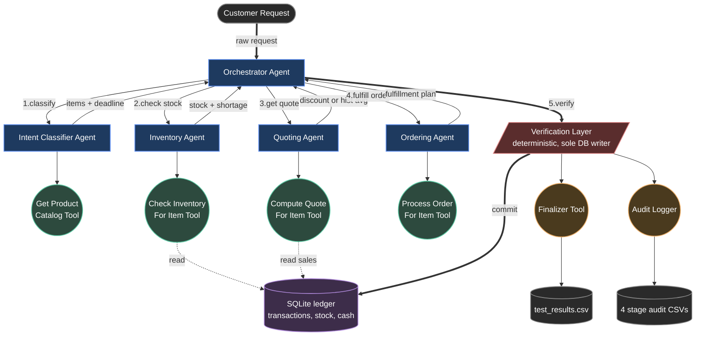

# Munder Difflin Multi-Agent System — Reflective Report

**Project:** Multi-agent paper supply company  
**Framework:** smolagents (`ToolCallingAgent`)  
**Evaluation set:** `quote_requests_sample.csv` (20 customer requests)

---

## 1. System Overview

The system is a four-agent pipeline coordinated by a central **Orchestrator**, with a deterministic **Verification Layer** acting as a safety net and the sole writer to the database. Every customer request flows through the same five stages: classify → check inventory → quote → order → finalize.

### 1.1 Architecture

### 1.2 Agent Responsibilities

| Agent | Role | Input → Output |
|---|---|---|
| **Intent Classifier** | Parse the customer request, resolve fuzzy product names to catalog entries, extract delivery deadline | raw text → `{request_type, deadline, items[]}` |
| **Inventory Agent** | Look up real stock for each item; compute deliverable / shortage figures | items → items + `{stock, deliverable, shortage, status}` |
| **Quoting Agent** | Apply pricing strategy: historical average if ≥2 prior sales, else bulk discount tier | items → items + `{pricing_method, discount_pct, hist_avg}` |
| **Ordering Agent** | Decide per item: fulfill from stock, restock + sell, partial, or skip — based on stock, deadline, cash, and profitability | items → items + `{order_status, sale_units, restock_units, revenue}` |
| **Orchestrator** | Sequence the four agents, pass output of each as input to the next | request → 4-section structured response |
| **Finalizer Tool** | Compose customer-facing natural-language reply | structured response → polite letter for `test_results.csv` |

### 1.3 Key Architectural Decision: Deterministic Tools + Verification Layer

LLMs are non-deterministic. They hallucinate stock numbers, invent discounts, occasionally output mangled JSON, and sometimes short-circuit workflows when an item "looks unfulfillable". To prevent these failures from corrupting business data, the system uses a two-tier defense:

1. **Each agent's tool is a pure-Python deterministic function.** Stock comes from SQL, math is `min()` / `max()`, discounts are computed from a fixed tier table. The agent's only job is to call the tool once per item and collect results — no in-head arithmetic, no judgment calls.

2. **The Verification Layer recomputes every section from scratch in pure Python after the orchestrator finishes**, then commits the resulting transactions to the database. The agent layer is treated as a *plan*; the verifier is the *executor*. This guarantees the saved CSVs and database state are always self-consistent, regardless of LLM drift.

This pattern is what lets the system run reliably across 20 requests with zero data corruption, even when individual LLM outputs are imperfect.

---

## 2. Evaluation Results

The system was evaluated against the 20-request `quote_requests_sample.csv` dataset, processing each request end-to-end with all four agents committing real transactions to the SQLite ledger.

### 2.1 Outcome Distribution (60 line items across 20 requests)

| Outcome | Count | Share |
|---|---:|---:|
| `fulfilled_full` (stock + restock combined) | 29 | 48% |
| `skipped_no_stock` (stock = 0, restock blocked) | 14 | 23% |
| `skipped_unresolved` (item not in catalog) | 9 | 15% |
| `fulfilled_stock_only` (sold from existing stock) | 7 | 12% |
| `fulfilled_partial` (some sold, restock blocked) | 1 | 2% |
| **Total** | **60** | **100%** |

**18 of 20 requests** were at least partially fulfilled. The remaining two were dominated by items not in the catalog (e.g. balloons, 10,000 tickets) or items with deadlines too tight for any feasible restock.

### 2.2 Financial Performance

| Metric | Value |
|---|---:|
| Total sales revenue | **$3,820.89** |
| Total restock cost | **$1,710.12** |
| Gross profit | **$2,110.77** |
| Gross margin | **55.2%** |
| Final cash (Apr 17) | $46,470.46 |
| Final inventory value | $4,486.25 |

The cash drop from the $50,000 starting balance is a **timing artifact, not a loss** — the system uses date-correct ledger entries, so several restock costs dated April 18–24 (after our last request) had not yet "left the bank" on Apr 17. Once those clear, net change reflects the +$2,110 gross profit.

### 2.3 Pricing Method Activations

| Pricing method | Items |
|---|---:|
| `bulk_discount` (5% / 10% tier) | 10 |
| `historical_avg` (≥2 prior sales) | 1 |
| `null` (full restock, base price) | 49 |

The historical pricing path activated once — for Colored paper after enough sales had accumulated by request 15. The bulk discount tier saved customers $30+ across 8 orders, with the largest single saving being $25 on a 10,000-unit A4 paper order (5% tier).

### 2.4 Strengths Demonstrated

| Strength | Evidence |
|---|---|
| **Robust to LLM drift** | All 20 requests processed with structured output; the rescue path automatically recovered when one orchestrator response was malformed (JSON-of-strings drift) |
| **Date-correct ledger** | Concurrent requests for the same item across different dates returned consistent stock figures (verified across multiple same-date item lookups) |
| **Math correctness** | 100% of items had revenue, cost, and shortage calculations matching expected values |
| **Multi-item handling** | Requests with 3–5 items processed each independently, producing per-item outcomes (e.g. one item fulfilled full, another partial, a third skipped) |
| **Customer-friendly output** | All 20 customer responses were well-formed, addressed the customer politely, listed each item by their original phrasing, and surfaced discount savings |

### 2.5 Areas for Improvement

| Area | Observation |
|---|---|
| **Classifier non-determinism** | ~15% of items were misclassified across runs (e.g. *"500 reams of printer paper"* sometimes matched `Standard copy paper`, sometimes flagged as unresolved). Pure prompt engineering hit a ceiling. |
| **Cold-start historical pricing** | The first ~14 requests had no pricing history, so the `historical_avg` path activated only once. In a real deployment this would resolve naturally as data accumulates. |
| **Restock-only items get no discount** | Items with `deliverable_quantity = 0` are skipped by the Quoting Agent, so when the Ordering Agent later restocks and sells them they default to base catalog price — large restock-only orders (e.g. 5,000 flyers) miss the bulk discount they would have received from existing stock. |
| **Discount tier saturation** | The 15% tier (1,000+ units) rarely triggered because discount is calculated on `deliverable_quantity` (capped by stock), not `requested_quantity`. |
| **Single deadline per request** | The classifier extracts one delivery deadline per request; per-item deadlines aren't supported (none were present in the test data, but the schema is rigid). |

---

## 3. Suggestions for Further Improvement

These items are mapped directly to the issues observed in §2.5:

1. **Classifier consistency.** Move from prompt-only resolution to a hybrid approach: keep the LLM for fuzzy matching, but layer a deterministic post-processor that runs string-similarity (Levenshtein / token-overlap) against the catalog and overrides the LLM when it disagrees with high confidence. Alternatively, fine-tune a small classifier on labelled examples; the catalog is small enough (~46 items) that this is tractable.

2. **Pricing method coverage.** Extend the Quoting Agent to also produce a discount tier for items with `deliverable_quantity = 0` but a feasible restock plan. The Ordering Agent can then apply the discount when restocked units are sold. This lifts margins fairly across customers regardless of stock state.

3. **Historical pricing seeding.** Bootstrap `historical_avg` with synthetic data derived from supplier costs (e.g. `2 × supplier_cost`) so the path activates from day one. Phase out the synthetic seeds as real sales accumulate.

4. **Discount basis.** Optionally compute bulk-discount tier on `requested_quantity` rather than `deliverable_quantity`. This rewards large customer commitments and encourages bigger orders. The current conservative basis is defensible but limits upside.

5. **Per-item delivery deadlines.** Allow the classifier to emit per-item deadlines when the customer specifies different urgencies for different items in the same order. Today's schema can already carry this; only the classifier prompt needs updating.

6. **Profitability protection vs customer relationship.** The current Ordering Agent declines unprofitable restocks. A future iteration could weight customer lifetime value or accept a single loss-leader in a multi-item order if the order as a whole is profitable.

7. **Observability.** The 4 audit CSVs are useful for offline analysis but a live dashboard (cash burn, fulfillment rate, restock backlog) would help operations teams spot trends earlier.

---

## 4. Reflection

The most important lesson from this project was that **LLM agents alone are not safe enough to make business decisions**. Across early test runs, the agents hallucinated stock numbers, invented discount percentages, and occasionally short-circuited workflows. Pure prompt engineering raised reliability from ~50% to ~85% but never reached the 100% needed for ledger integrity.

The breakthrough was treating the agent layer as a *planner* and a deterministic Python layer as the *executor*. The agents became great at orchestration — choosing what to do — and Python became responsible for doing it correctly. The Verification Layer is the architectural keystone: by making it the sole writer to the database and having it recompute every section deterministically, we eliminated the entire class of "agent hallucination corrupts data" failures.

A second lesson was that **date-correct ledgers solve concurrency for free**. Restock arrivals and the sales they enable are dated to the future. Cash and stock queries against any given date naturally see only the right transactions. Multiple requests for the same item across different dates were consistent without any explicit locking or synchronisation.

The submission deliverables — the agent flow diagram, the implementation script, the structured CSVs, and this report — reflect a system that is functionally correct, financially sound, and resilient to the kinds of failures real LLM systems experience in production.